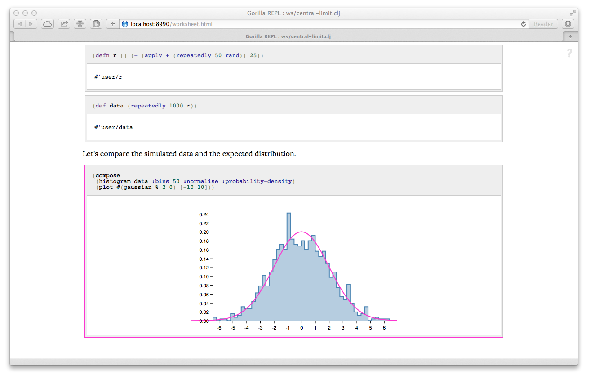

Gorilla is a rich REPL for Clojure in the notebook style. What on earth does that mean, you say? Well, maybe it's best
to take a look at a [short video](https://vimeo.com/87118206) showing you what it can do:

<iframe src="//player.vimeo.com/video/87118206" width="500" height="313" frameborder="0" webkitallowfullscreen
mozallowfullscreen allowfullscreen></iframe>

You can think of it like a pretty REPL that can plot graphs and draw tables, or you can think of it as an editor for
rich documents that
can contain interactive Clojure code, graphs, tables, notes, LaTeX formulae. Whatever works for you! One of the main
aims is to make it lightweight enough that you can use it day-to-day instead of the command-line REPL, but also offer
the power to perform and document complex data analysis and modelling tasks. Above all else, Gorilla tries not to
dictate your workflow, but rather to fit in to the way you like to work, hopefully putting a bit more power to your
elbow.

<!--  -->

## Learning more

The first thing you should do is read the [getting started](/start.html) page which runs through the installation of
Gorilla and its basic operation. After you've made your first Gorilla worksheet you can easily share it with the world,
for free, using the [online viewer](/viewer.html). Gorilla has a very flexible renderer, and if you start using Gorilla
frequently you
will probably want to learn how it works. You can find all the information you need on the [renderer](/renderer.html)
page. There's a page with some boring but useful information about Gorilla's
[configuration options](/configuration.html). There are a few videos which
discuss various aspect of Gorilla in depth, you can find them on the
[videos](/videos.html) page. If you really get into Gorilla, and want to contribute some code then you'll find some
useful notes on the [developers](/developers.html) page.

## Getting in touch

At the moment your best bet is to ping me on email. If there's demand then I'll get a discussion list set up. You may
need to use your initiative to figure out my contact details!

## Contributing

Contributions, in the form of comments, criticism, bug reports, or code are all very welcome :-) If you've got an idea
for a big change drop me an email so we can coordinate work.

In order of first commit, code contributors to date are:

- @JonyEpsilon
- @maio
- @cldellow
- @scottdw
- @shriphani
- @gfredericks
- @modellurgist

There are many others who have filed bugs, requested features, and contributed to the discussion. They've all made Gorilla REPL better in one way or another!

## Licence

Gorilla is open-source software, and is licensed to you under the MIT licence.

